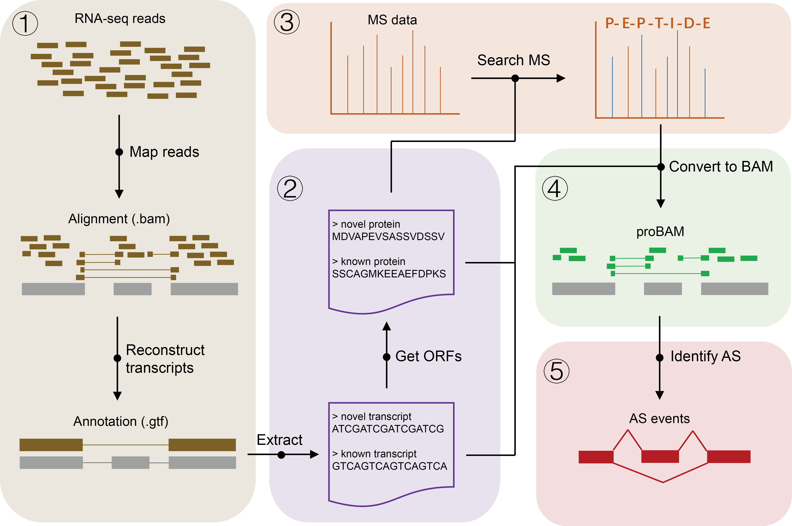

# PASS

- **Description**: a **P**roteomics **A**lternative **S**plicing **S**creening pipeline.





- **Version**: 1.1.0

- **Install**
  - unzip PASS-master.zip
  - chmod a+x *
  - export PATH=/PASS_install_path/:$PATH

- **System requirements**

  - [Tophat2](https://cole-trapnell-lab.github.io/cufflinks/)
    - wget tophat2-*.tar.gz
    - tar -zxvf tophat2-*.tar.gz
    - export PATH=/topaht2_install_path/:$PATH
  - [Cufflinks](https://cole-trapnell-lab.github.io/cufflinks/)
    - wget cufflinks-*.tar.gz
    - tar -zxvf cufflinks-*.tar.gz
    - export PATH=/cufflinks_install_path/:$PATH
  - [MSGF+](https://github.com/MSGFPlus)
    - wget MSGFPlus_v20190228.zip
    - unzip MSGFPlus_v20190228.zip


- **processRNASEQ**:

    - **Description**: Align RNA-Seq reads to the reference genome and reconstruct transcripts.

    - **Usage**: `processRNASEQ [options] -g <genome> -f <.gtf> -r <.fastq>`

        ```
        -g    Genome bowtie2 index name.
        -f    Gene annotation file, .gtf format.
        -r    File names for sequencing reads, .fastq format.
              - Compressed files (.fastq.gz) are also supported.
              - Paired-end files separated by commas.
        -t    Path to tophat, eg. /home/user/bin/tophat
              - By default, we try to search tophat in system PATH.
        -c    Path to cufflinks, eg. /home/user/bin/cufflinks
              - By default, we try to search cufflinks in system PATH. 
        -p    Number of used threads. [Default: 12]
        -o    Output folder. [Default: ./PASS_out]
        -h    Help message.
        ```

    - **Example**: `processRNASEQ -g path_genomeandbowtie2index/genome.test -f exampleData/genes.test.gtf -r exampleData/Sample_R1.fastq.gz,exampleData/Sample_R2.fastq.gz`

- **getORF**:

    - **Description**: Protein sequences translation.

    - **Usage**: `getORF [options] -f <.gtf> -g <genome.fa>`

        ```
	  -f    File name of gene annotation, .gtf format.
              - Recommend cufflinks to generate this file. 
	  -g    Reference genome file name, fasta format.
	  -o    Output folder. [Default: ./PASS_out]
	  -h    Help message.
        ```

    - **Example**: `getORF -f exampleData/transcripts.gtf -g exampleData/genome.test.fa`

    - **Output**:
    
	  - transcripts.longestorf.gtf
	  - transcript.longestorf.fa
	  - protein.longestorf.fa

- **searchMS**:

    - **Description**: Search MS file against protein sequence database.

    - **Usage**: `searchMS [options] -s <MSGF_path> -m <example.mzML> -f <protein.fa>`

        ```
	  -s    Path to MSGFPlus.jar. eg. ~/software/MSGF.
	  -m    MS/MS file. 
              - Support file formats including .mzML, .mzXML, .mgf, .ms2, .pkl and _dta.txt
              - Spectral should be centroided.
	  -f    Protein sequences
	  -p    Number of used threads. [Default: 12]
	  -t    Modification file name.
	  -o    Output folder. [Default: ./PASS_out]
	  -h    Help message.
        ```

    - **Example**: `searchMS -s ~/software/MSGF -m exampleData/example.mzML -f exampleData/protein.longestorf.fa`
    
    - **Output**:
    
      - PSM.tab

- **generateSAM**:

    - **Description**: Convert peptide spectal matches to alignment file.

    - **Usage**: `generateSAM [options] -m <PSM> -f <.gtf> -t <transcript.fa> -p <protein.fa>`

        ```
	  -m    Peptide spectral matches.
	  -f    File name of gene annotation, .gtf format.
	  -t    File name of transcript sequences, .fa format.
	  -p    File name of protein sequences, .fa format.
	  -o    Output folder. [Default: ./PASS_out]
	  -h    Help message.
        ```

    - **Example**: `generateSAM -m exampleData/PSM.tab -f exampleData/transcripts.longestorf.gtf -t exampleData/transcript.longestorf.fa -p exampleData/protein.longestorf.fa`

    - **Output**:
        - PSM.sam 


- **screenAS**:

    - **Description**: Detect AS events from annotation and alignment file.

    - **Note**: This function code is sourced from [MATS](https://rnaseq-mats.sourceforge.net).

    - **Usage**: `screenAS [options] -s <PSM.sam> -g <genes.gtf>`

        ```
	  -s    Sam format file generated by proteome identification.
	  -g    Gene annotation file, .gtf format.
	  -o    Output folder. [Default: ./PASS_out]
	  -h    Help message.
        ```

    - **Example**: `screenAS -s exampleData/PSM.sam -g exampleData/transcripts.longestorf.gtf`

    - **Output**

      - summary.txt
      - PASS.SE.txt
      - PASS.RI.txt
      - PASS.MXE.txt
      - PASS.A5SS.txt
      - PASS.A3SS.txt
      - PASS.AFE.txt
      - PASS.ALE.txt
      
- **PASS**: 

    - **Description**: All-in-one command.
    
    - **Usage**: `PASS [options] -g <genome> -f <genes.gtf> -r <reads.fastq> -s <MSGFPlus.jar> -m <example.mzML>`
    
      ```
	  -g    Genome bowtie2 index name.
	  -f    Gene annotation file, .gtf format.
	  -r    File names for sequencing reads, .fastq format.
              - Compressed files (.fastq.gz) are also supported.
              - Paired-end files separated by commas.
	  -t    Path to tophat, eg. /home/user/bin/tophat
		- By default, we try to search tophat in system PATH.
	  -c    Path to cufflinks, eg. /home/user/bin/cufflinks
		- By default, we try to search cufflinks in system PATH. 
	  -p    Number of used threads. [Default: 12]
	  -s    Path to MSGFPlus.jar. eg. ~/software/MSGF.
	  -m    MS/MS file. 
              - Support file formats including .mzML, .mzXML, .mgf, .ms2, .pkl and _dta.txt
              - Spectra should be centroided.
	  -d    Modification file name.
	  -o    Output folder. [Default: ./PASS_out]
	  -h    Help message.
      ```
      
    - **Example**: `PASS -g path_genomeandbowtie2index/genome.test -f exampleData/genes.test.gtf -r exampleData/Sample_R1.fastq.gz,exampleData/Sample_R2.fastq.gz -s ~/software/MSGF -m exampleData/example.mzML -p 4`
    
   - **Output**: 

     - summary.txt
     - PASS.SE.txt
     - PASS.RI.txt
     - PASS.MXE.txt
     - PASS.A5SS.txt
     - PASS.A3SS.txt
     - PASS.AFE.txt
     - PASS.ALE.txt

- **Contact**:

    Peng Wu; wupeng1@ihcams.ac.cn
